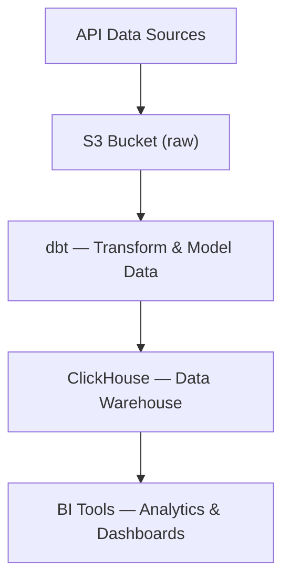
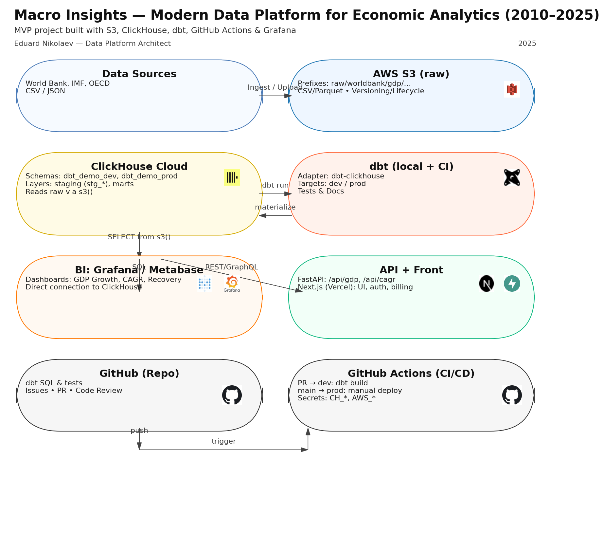
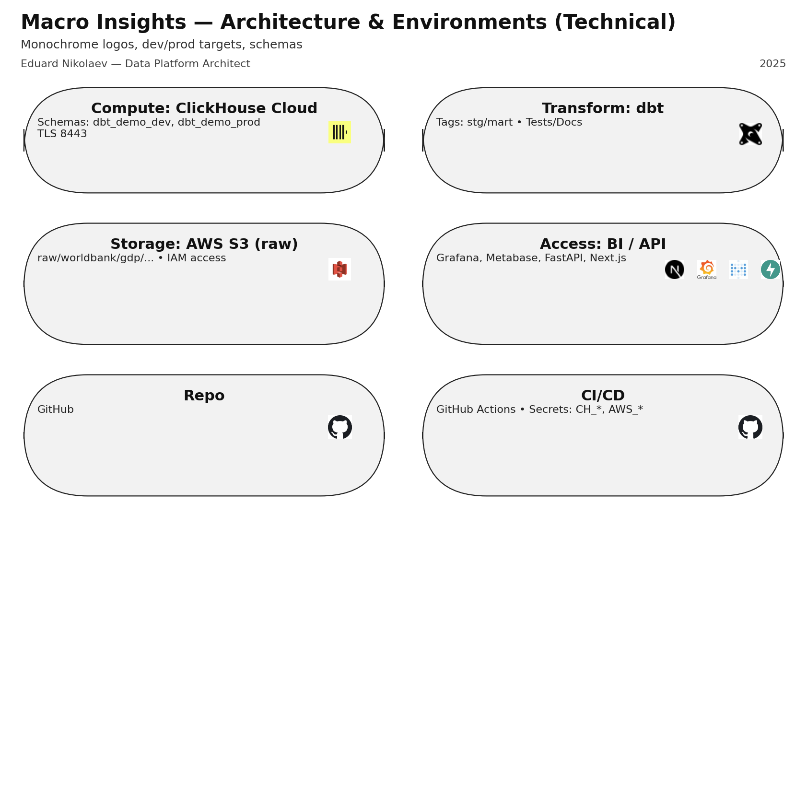
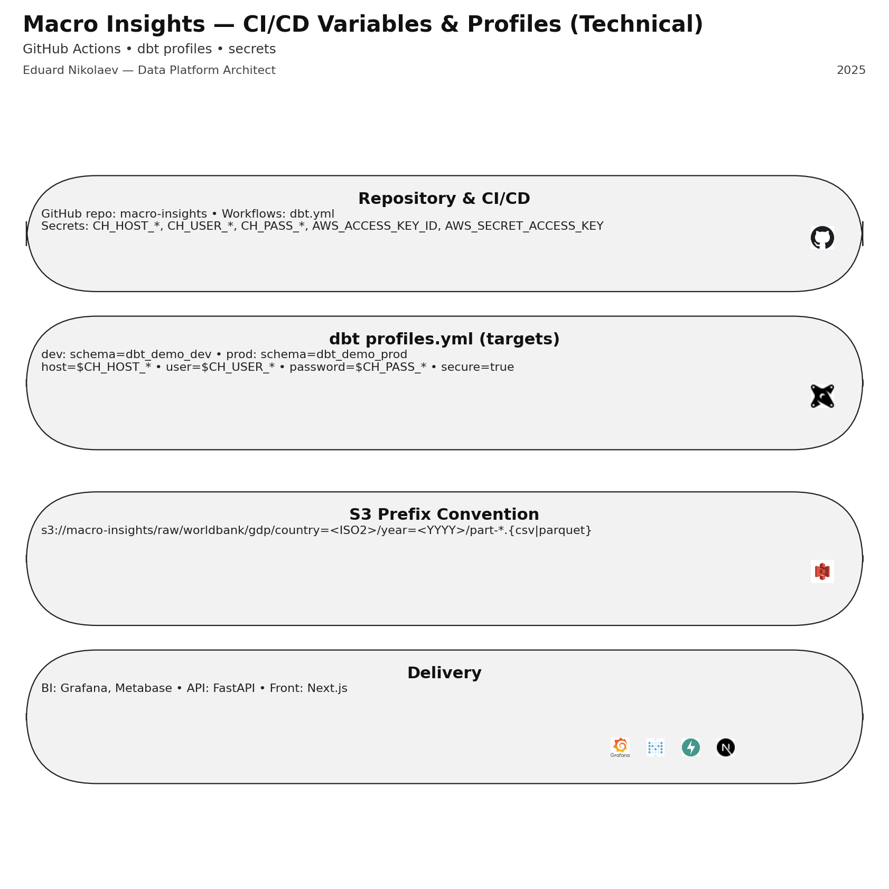
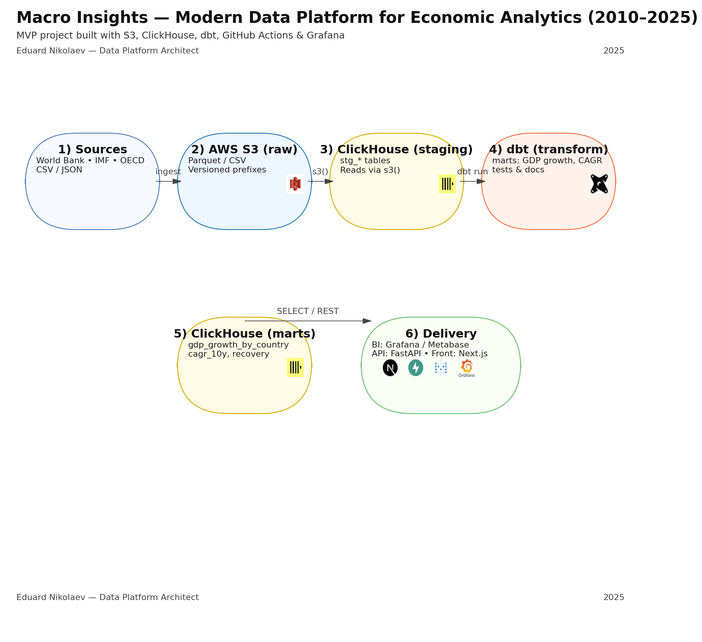
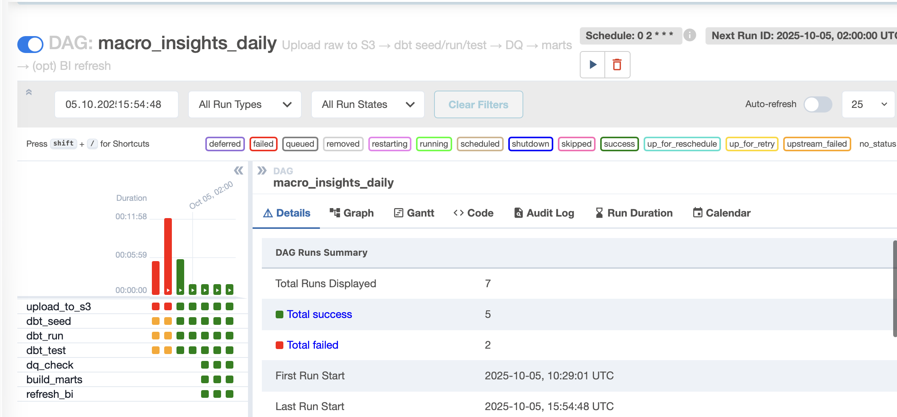
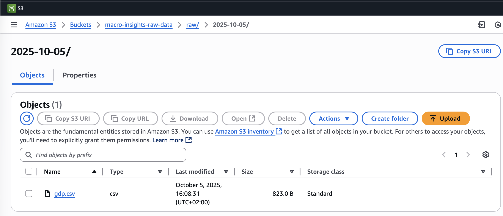
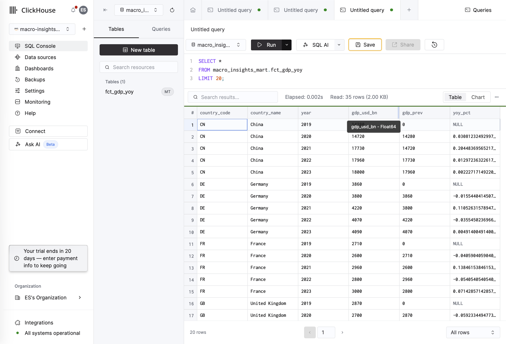

# 📊 Macro Insights — Data Platform MVP

End-to-end data platform prototype for macroeconomic analytics, built as a **minimal viable product (MVP)**.
The pipeline lands raw data from API sources into **Amazon S3**, transforms it with **dbt**, and materializes marts in **ClickHouse** — ready for BI tools like **DataLens** or **Metabase**.

---

## 🚀 Architecture Overview



✅ **MVP Pipeline Summary:** API → S3 → dbt → ClickHouse → BI-ready

---

## 🏗️ Full Stack Architecture



## 🧰 Technical Environments



## 🔄 CI/CD Reference



## 📊 Data Flow



---

## 🧩 Tech Stack

| Layer | Tools |
|-------|-------|
| Storage | **Amazon S3** — raw data landing, lifecycle |
| Transform | **dbt** + **dbt-clickhouse** — staging & marts |
| Warehouse | **ClickHouse Cloud** |
| Orchestration | **Airflow (Docker, local)** — DAG seed/run/test |
| CI/CD (opt) | **GitHub Actions** — diagrams & repo checks |
| BI (opt) | **Yandex DataLens / Metabase** |

---

## 📸 Screenshots

### ✅ Airflow DAG — Successful Run


### 📂 S3 — Raw Data Landing


### 📈 ClickHouse — Analytical Table


---

## 📦 How to Run Locally

> Prereqs: Docker Desktop; AWS & ClickHouse creds (`.env` or Airflow Variables)

```bash
cd airflow
docker compose down -v
docker compose up airflow-init
docker compose up -d
```
- UI: http://localhost:8080 (admin / admin)
- Trigger DAG: `macro_insights_daily`

Check results:
- S3: `s3://macro-insights-raw-data/raw/YYYY-MM-DD/gdp.csv`
- ClickHouse:
```sql
SELECT * FROM macro_insights_mart.fct_gdp_yoy LIMIT 20;
```

---

## 🧪 dbt Commands

```bash
dbt seed --profiles-dir .
dbt run --profiles-dir .
dbt test --profiles-dir .
```

Main models:
- `models/staging/stg_gdp.sql` — normalize raw GDP
- `models/marts/fct_gdp_yoy.sql` — compute YoY metrics

---

## 🔮 Future Enhancements

- Add CPI, inflation and more macro indicators
- Build combined marts with multiple metrics
- Implement incremental loads
- CI/CD workflows for dbt
- Managed orchestration (Astronomer / MWAA)

---

## 👤 Author

**Eduard Nikolaev** — Data Platform Architect / DataOps Engineer
🔗 [LinkedIn](https://www.linkedin.com/in/eduard-nikolaev/) · 📁 *Macro Insights — Data Platform MVP*

---

## 📜 License

[MIT License](./LICENSE) © 2025 Eduard Nikolaev
